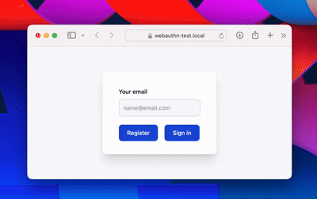

# Go WebAuthn/Passkey Example

This is a simple example of WebAuthn and Passkey authentication using Go, Tailwind, and HTMX.

## Run

```shell
$ go generate ./...
$ go build -o passkeys
$ ./passkeys
```

Ensure that your browser trusts the generated self-signed certificates.

Then go to https://web-authn.local

